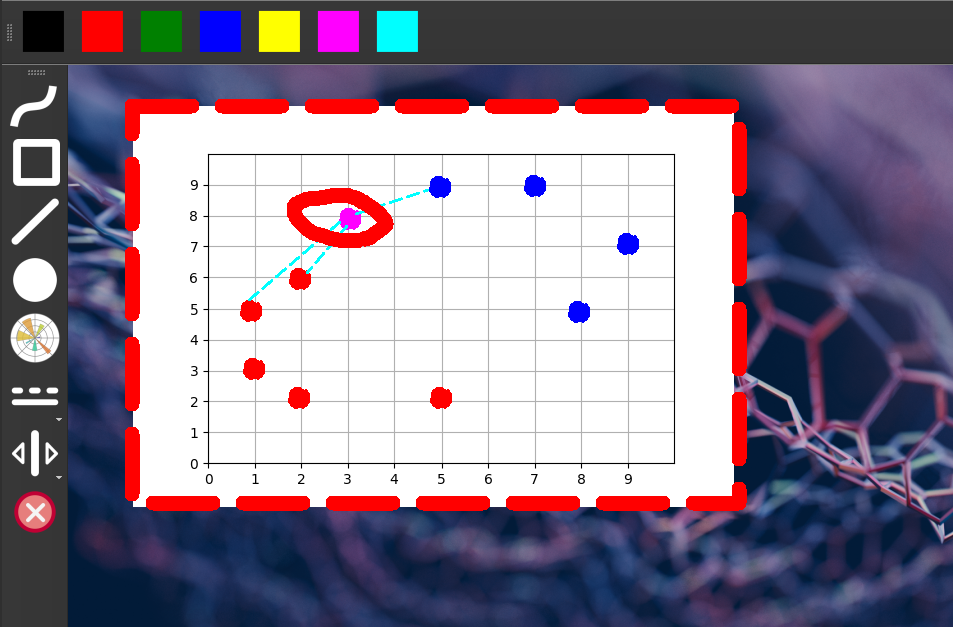

# Simple pen

## Description

Super simple screen annotation software which allows drawing directly on the screen:
* line,
* rectangle,
* chart (using matplotlib).
The application allows writing directly on the screen.

The behavior of he programs depends on the OS you use:
* For Linux transparent background is used (you can see a video playing in the background).
* For Windows, the screenshot is taken, and the user draws on the captured image (you see a static image of the screen).

### Controls
* Left mouse button - drawing.
* Right mouse button - quit.
* Keyboard shortcuts:
    * `Ctrl+Z` - undo
    * `Ctrl+Y` - redo

### Screenshot



*Note: The app is created ad-hoc only for my use case. It may contain bugs, and the code definitely is not clean.*

## Usage

Tu run the program:

### Pip

```bash
pip install -r requirements.txt
python screenpen.pyw
```

### Conda

Once virtual env is activated:
```bash
conda install --file requirements.txt
python screenpen.pyw
```
